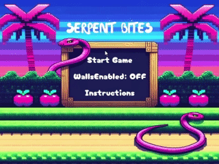
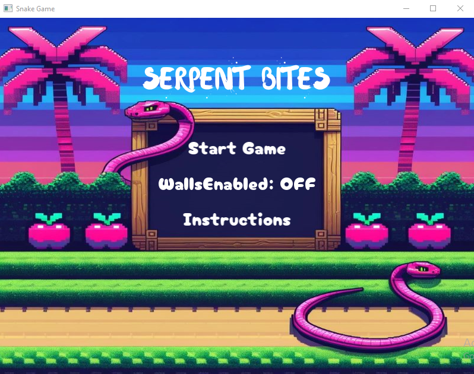
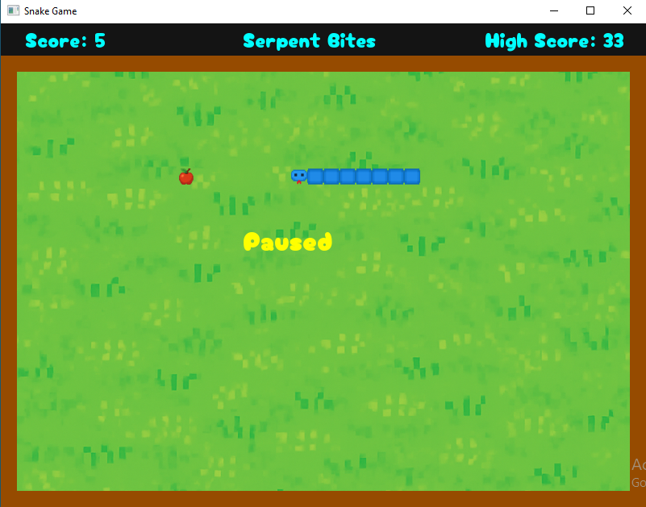
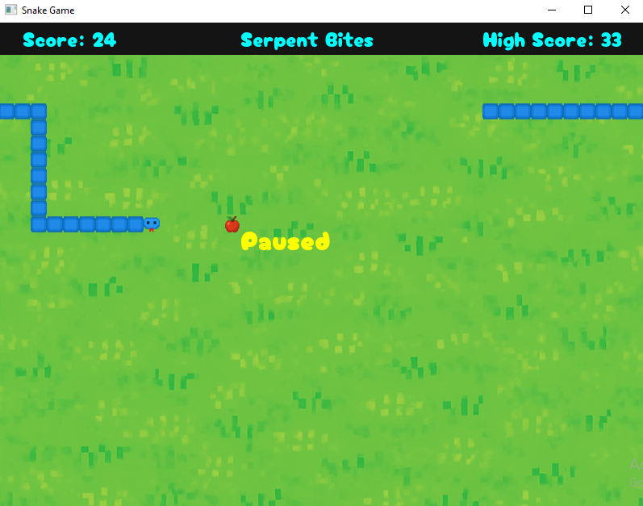
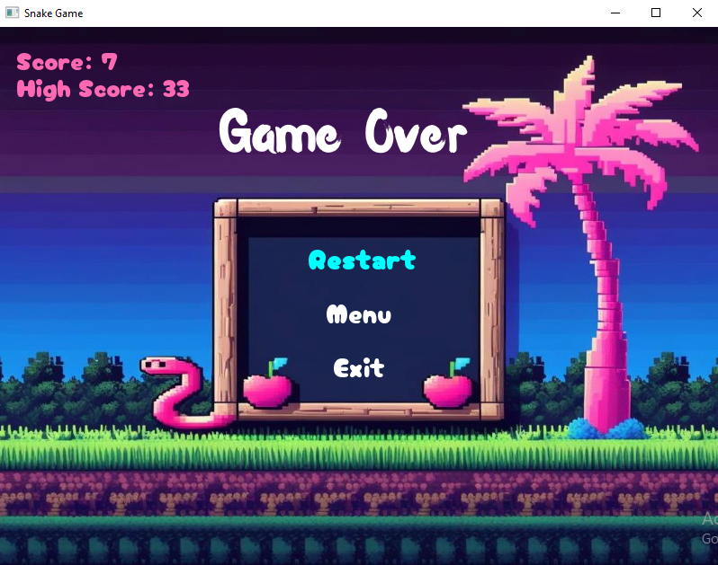
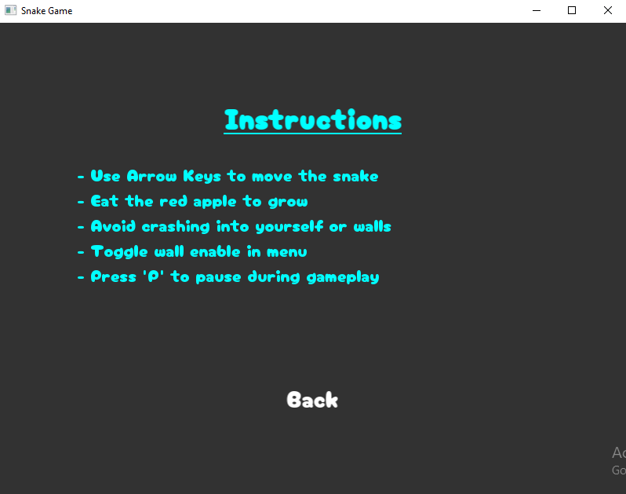

# 🐍 Serpent Bites - Modern Snake Game

A polished, feature-rich implementation of the classic Snake game built with C++ and SFML. This project showcases clean code architecture, smooth gameplay mechanics, and engaging visual effects.


## 🎥 Demo



*Featuring particle effects, smooth animations, and polished gameplay*

## ✨ Features

### Gameplay
- **Classic Snake Mechanics** - Grow by eating food, avoid collisions
- **Toggleable Wall Collision** - Play with or without boundary walls
- **Progressive Difficulty** - Speed increases every 5 points
- **Screen Wrapping** - Snake wraps around edges when walls are disabled
- **Persistent High Score** - Your best score is saved between sessions

### Visual Effects
- 🎆 **Particle System** - Sparkle effects when eating food
- 💥 **Death Explosion** - Dramatic particle burst on collision
- 📊 **Score Popups** - Floating score indicators
- 🎨 **Smooth Animations** - Polished transitions and effects

### User Interface
- 🎮 **Main Menu** - Clean, intuitive navigation
- ⚙️ **Settings Toggle** - Enable/disable walls from menu
- 📖 **Instructions Screen** - Clear game controls and rules
- ⏸️ **Pause Functionality** - Pause/resume with 'P' key
- 🏆 **High Score Display** - Always visible during gameplay

## 🎮 Controls

| Key | Action |
|-----|--------|
| **Arrow Keys** | Move snake (Up/Down/Left/Right) |
| **P** | Pause/Resume game |
| **Enter** | Start game from menu |
| **R** | Restart from game over screen |
| **M** | Return to menu from game over |
| **Mouse** | Navigate menus and click buttons |

## 🛠️ Technical Details

### Architecture
- **Object-Oriented Design** - Clean separation of concerns
- **Component-Based** - Modular game systems (Snake, Food, Score, Particles)
- **State Management** - Robust game state system (Menu, Playing, Game Over, Instructions)
- **Memory Optimized** - Pre-allocated vectors, efficient particle management

### Key Components
```
├── Snake       - Player-controlled entity with collision detection
├── Food        - Spawning system with grid-based placement
├── Game        - Core game loop and logic coordinator
├── Score       - Scoring system with persistent high score
├── ParticleSystem - Visual effects and particle physics
├── UIManager   - Menu system and user interface
└── UIButton    - Interactive menu buttons
```

### Code Highlights
- **Predictive Collision Detection** - Checks next position before moving
- **Smart Food Spawning** - Avoids snake body with infinite loop prevention
- **Visual Effects** - Sparkle effects, death explosion and score floating effects
- **Comprehensive Comments** - Well-documented code for easy understanding

## 📋 Requirements

### Dependencies
- **SFML 2.5+** - Simple and Fast Multimedia Library
- **CMake 3.10+** - Build system generator
- **C++17 Compiler** - GCC, Clang, or MSVC
- **MinGW-w64** (Windows) - For compiling on Windows

### Platform Support
- ✅ Windows (Primary)
- ✅ Linux
- ✅ macOS

## 🚀 Building the Game

### Windows (MinGW)

1. **Install Dependencies**
   ```bash
   # Install MSYS2 from https://www.msys2.org/
   # Open MSYS2 MinGW 64-bit terminal
   pacman -S mingw-w64-x86_64-gcc
   pacman -S mingw-w64-x86_64-cmake
   pacman -S mingw-w64-x86_64-sfml
   ```

2. **Clone and Build**
   ```bash
   git clone https://github.com/swati048/snake-game.git
   cd snake-game
   mkdir build && cd build
   cmake -G "MinGW Makefiles" ..
   cmake --build .
   ```

3. **Run**
   ```bash
   ./snake.exe
   ```

### Linux

1. **Install Dependencies**
   ```bash
   # Ubuntu/Debian
   sudo apt-get install build-essential cmake
   sudo apt-get install libsfml-dev
   
   # Arch Linux
   sudo pacman -S base-devel cmake sfml
   ```

2. **Clone and Build**
   ```bash
   git clone https://github.com/yourusername/snake-game.git
   cd snake-game
   mkdir build && cd build
   cmake ..
   make
   ```

3. **Run**
   ```bash
   ./snake
   ```

### macOS

1. **Install Dependencies**
   ```bash
   # Install Homebrew from https://brew.sh/
   brew install cmake
   brew install sfml
   ```

2. **Clone and Build**
   ```bash
   git clone https://github.com/yourusername/snake-game.git
   cd snake-game
   mkdir build && cd build
   cmake ..
   make
   ```

3. **Run**
   ```bash
   ./snake
   ```
   
## 📸 Screenshots

### Main Menu

*Clean, intuitive menu with wall toggle option*

### Gameplay With Walls Enabled

*Smooth gameplay with walls enabled and score display*

### Gameplay With Walls Disabled

*Smooth gameplay with walls disabled and score display*

### Game Over

*Game over screen displaying score and highscore with restart, menu and exit button*

### Instructions 

*Precise game control and rules instructions*

## 📁 Project Structure

```
snake-game/
├── src/
│   ├── main.cpp              # Entry point
│   ├── Snake.cpp             # Snake entity logic
│   ├── Food.cpp              # Food spawning system
│   ├── Game.cpp              # Game coordinator
│   ├── Score.cpp             # Score management
│   ├── ParticleSystem.cpp    # Visual effects
│   ├── UIManager.cpp         # UI and menu system
│   └── UIButton.cpp          # Button component
├── include/
│   ├── Snake.hpp
│   ├── Food.hpp
│   ├── Game.hpp
│   ├── Score.hpp
│   ├── ParticleSystem.hpp
│   ├── GameState.hpp
│   ├── UIManager.hpp
│   └── UIButton.hpp
├── resources/
│   ├── snake_head.png        # Snake head texture
│   ├── snake_body.png        # Snake body texture
│   ├── food.png              # Food texture
│   ├── background.png        # Game background
│   ├── menu_background.png   # Menu background
│   ├── gameOver_bg.png       # Game over background
│   └── CherryBombOne-Regular.ttf  # Game font
├── .vscode/
│   ├── c_cpp_properties.json # VSCode C++ config
│   ├── launch.json           # Debug configuration
│   └── settings.json         # CMake settings
├── CMakeLists.txt            # Build configuration
├── highscore.txt             # Persistent high score
└── README.md                 # This file
```

## 🎨 Customization

### Modify Game Speed
In `main.cpp`:
```cpp
const float SNAKE_SPEED = 20.0f;  // Change block size/speed
```

### Adjust Difficulty Curve
In `Game.cpp`:
```cpp
// Speed increases every 5 points by default
if (score.getValue() % 5 == 0) {
    speedMultiplier += 0.1f;  // Adjust increment
}
```

### Change Particle Count
In `Game.cpp`:
```cpp
// Food collection particles
particleSystem.createBurst(position, 15, color);  // Adjust count

// Death explosion particles
particleSystem.createExplosion(position, 40, color);  // Adjust count
```

### Modify Colors
In respective `.cpp` files:
```cpp
// Wall color
wall.setFillColor(sf::Color(150, 75, 0));  // Brown

// Particle colors
sf::Color::Yellow  // Food particles
sf::Color::Red     // Death particles
```

## 🐛 Known Issues

- None currently! 🎉

## 🔮 Future Enhancements

- [ ] Sound effects and background music
- [ ] Multiple difficulty levels
- [ ] Power-ups (speed boost, invincibility, score multiplier)
- [ ] Obstacles and special food types
- [ ] Leaderboard with player names
- [ ] Theme selector (different color schemes)
- [ ] Multiplayer mode
- [ ] Mobile touch controls

## 📝 Development Notes

### Design Decisions

**Why SFML?**
- Cross-platform compatibility
- Simple API for 2D graphics
- Good performance for particle effects
- Active community support

**Why Static Linking?**
- Single executable distribution
- No external DLL dependencies
- Easier for portfolio deployment

**Particle System Design**
- Used vector with reserve() for memory efficiency
- Lifetime-based particle removal
- Physics simulation (velocity, gravity, fade)
- Separate burst and explosion types for variety

**Collision Detection**
- Predictive checking prevents teleportation bugs
- Separate wall and self-collision logic
- Grid-aligned movement prevents sub-pixel issues

## 🤝 Contributing

Contributions are welcome! Feel free to:
- Report bugs
- Suggest features
- Submit pull requests
- Improve documentation

## 👤 Author

**[Swati Thakur]**
- GitHub: [@swati048](https://github.com/swati048)
- LinkedIn: [Swati Thakur](https://linkedin.com/in/swati048)
- Email: [thakurswati048@gmail.com](mailto:thakurswati048@gmail.com)

## 🙏 Acknowledgments

- **SFML Team** - For the excellent multimedia library
- **Cherry Bomb Font** - Font used in the game
- **Classic Snake Game** - Original inspiration from Nokia phones

---

<div align="center">

**⭐ Star this repository if you found it helpful! ⭐**

Made with ❤️ and C++

</div>